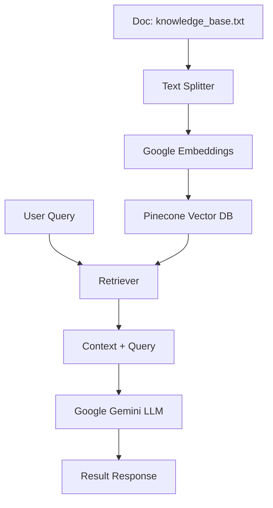

# Pinecone RAG Project

### Author: Raquel Selma
This repository contains the implementation of a Retrieval-Augmented Generation (RAG) system using LangChain, Google Gemini, and Pinecone.

## Architecture

The system follows a standard RAG architecture:
1. **Data Ingestion**: Documents are loaded and split into smaller chunks.
2. **Embedding**: Text chunks are converted into vector embeddings using Google's `embedding-001` model.
3. **Vector Storage**: Embeddings and metadata are stored in a Pinecone Serverless Index.
4. **Retrieval**: When a query is made, it is embedded, and the most relevant chunks are retrieved from Pinecone.
5. **Generation**: The retrieved chunks and the query are passed to Google's Gemini 1.5 Flash to generate a context-aware answer.



## Setup Instructions

### Prerequisites
- Python 3.8+
- Google Gemini API Key (Get it free from Google AI Studio)
- Pinecone API Key
- A Pinecone Index (The script will attempt to create one if it doesn't exist)

### Installation

1. **Clone the repository** (or navigate to the folder).
2. **Create a virtual environment**:
   ```bash
   python -m venv venv
   source venv/Scripts/activate  # On Windows: venv\Scripts\activate
   ```
3. **Install dependencies**:
   ```bash
   pip install -r requirements.txt
   ```
4. **Configure Environment Variables**:
   - Create a `.env` file in the root directory.
   - Copy the content from `.env.example`.
   - Fill in your `GOOGLE_API_KEY`, `PINECONE_API_KEY`, and a `PINECONE_INDEX_NAME`.

## Running the Code

1. Ensure you have a `knowledge_base.txt` file with the content you want to index.
2. Execute the RAG system:
   ```bash
   python rag_system.py
   ```

## Example Output

```text
Index 'arep-lab04-index' already exists.
Loading and splitting document...
Embedding and indexing documents...

--- RAG System Ready ---
Question: What is the primary objective of the AREP LAB04?

Answer:
The primary objective of the AREP LAB04 is to introduce students to the fundamental concepts and practical implementation of Retrieval-Augmented Generators (RAGs) using OpenAI’s tools and the LangChain framework.
```

## Screenshots / Code in Action

Here are some screenshots demonstrating the working application:

### 1. Terminal Execution

*Successful execution of the RAG system answering a query based on the knowledge base.*

### 2. Pinecone Vector Database

*The `lab04-index-v3` index created in Pinecone, storing the 768-dimensional vector embeddings.*

### 3. Project Setup

*Project structure and LCEL implementation in VS Code.*

